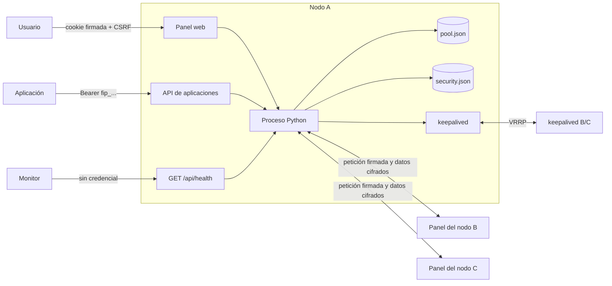
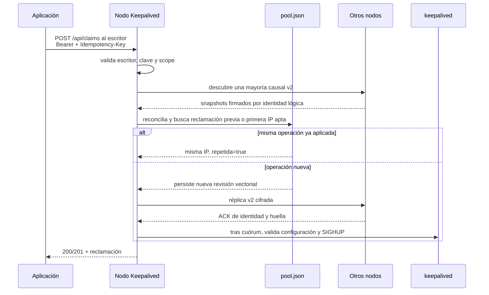
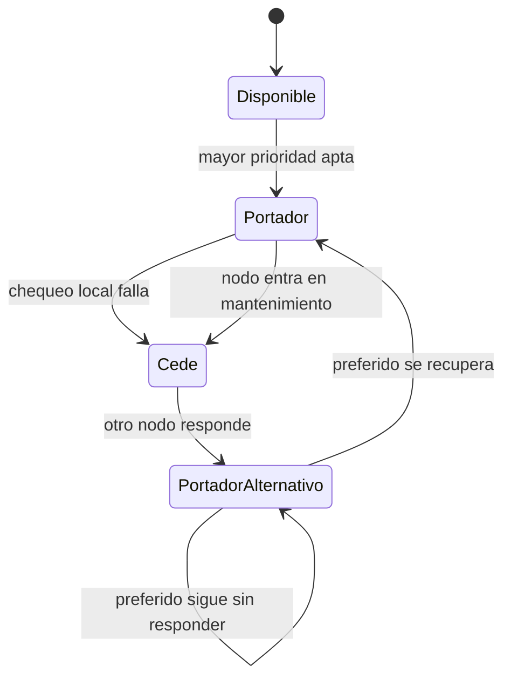

# Arquitectura de Keepalived / floating-ip

## Objetivo

El producto mantiene un conjunto de direcciones IPv4 flotantes sobre varios nodos. Cada
dirección la sostiene el nodo que puede servir realmente la aplicación asociada; no basta
con que la máquina responda. El mismo contenedor ejecuta `keepalived`, el panel y la API.

## Vista general

## Planos separados

| Plano | Consumidor | Credencial | Capacidades |
|---|---|---|---|
| Salud | monitorización | ninguna | confirmar únicamente proceso y versión |
| Aplicaciones | servicios y provisionadores | clave API | consultar estado, reclamar y liberar |
| Operación | personas | sesión web | pool, asignación, mantenimiento y estado completo |
| Administración | administradores | sesión; contraseña y 2FA para acciones sensibles | usuarios, 2FA y claves API |
| Clúster | otros nodos declarados | HMAC y cifrado compartido | vista local, reconciliación causal y réplica de estado |

Una clave API nunca concede acceso a usuarios, mantenimiento o colocación. Una aplicación
declara para qué usa una dirección, pero no decide en qué nodo debe vivir.

El primer nodo de la topología es el único escritor del plano de control. La pantalla de
configuración permite editar todos los valores, incluidos nombres y orden. En un clúster que ya
tiene estado causal, cambiar la identidad del escritor exige migrar ese estado de forma
coordinada en todos los miembros; editar un único nodo no constituye esa migración. Si
ese nodo se pierde, VRRP y las lecturas siguen funcionando,
pero las mutaciones se cierran hasta recuperarlo; no se elige otro escritor automáticamente.

## Flujo de una reclamación

Si la persistencia local se completa pero no puede confirmarse la mayoría, la respuesta es
un commit incierto. El cliente consulta el estado antes de reintentar y conserva la misma
`Idempotency-Key`; nunca crea una operación alternativa a ciegas.

## Persistencia

- `pool.json`: direcciones, reclamaciones, mantenimiento y revisión vectorial del pool.
- `security.json`: usuarios, hashes de contraseña, TOTP cifrado, hashes de claves API y
  revisión vectorial del acceso.
- `keepalived.conf`: configuración generada y validada antes de recargar VRRP; contiene la clave
  VRRP y debe tratarse, junto con sus backups, como material sensible.
- `/run/floating-ip`: estado efímero de drenaje; se monta como `tmpfs`.

Los secretos de sesión y clúster no están en esos archivos ni en la imagen. Los aporta la
plantilla del servidor y deben ser iguales en todos los nodos.

Las marcas de tiempo no deciden qué réplica gana. Sólo se acepta el único snapshot que domina
causalmente a todos los demás; ramas concurrentes o el mismo reloj con contenido diferente
fallan de forma cerrada. El cuórum es mayoría de nombres lógicos declarados, no de URL ni de
respuestas duplicadas. Un receptor persiste la réplica, pero sólo aplica configuración VRRP
después de reconciliarla con su propia mayoría.

El arranque ejecuta primero el panel. Keepalived no nace hasta que el pool está reconciliado,
la configuración local ha sido validada y existe el marcador efímero `pool-ready`. Así, un
nodo que vuelve aislado no anuncia VIP desde una copia obsoleta.

## Compatibilidad del protocolo interno

La réplica causal usa rutas internas v2 separadas para pool y acceso. Antes de enviar un
snapshot, el emisor exige que el par demuestre la capacidad correspondiente mediante una
lectura autenticada. No existe fallback a la ruta antigua: un nodo de una versión anterior no
cuenta para el cuórum v2 y no recibe un `POST` que pudiera interpretar con otro contrato.
Las rutas son `GET /api/internal/v2/pool`, `POST /api/internal/v2/pool/replica`,
`GET /api/internal/v2/security` y `POST /api/internal/v2/security/replica`; todas requieren
autenticación entre nodos y los snapshots viajan cifrados.

## Preflight y selección del artefacto

El adaptador remoto observa y descarga de forma privada `pool.json` y `security.json` de todas
las identidades antes de modificar el almacenamiento o detener un contenedor. Construye un
manifiesto de esas copias y lo valida con el código de la propia imagen candidata Linux en un
contenedor temporal sin red, con rootfs de sólo lectura, sin capacidades y con
`no-new-privileges`. El preflight rechaza esquema inválido, topología distinta, ramas causales
concurrentes, ausencia no autorizada y falta de cuórum.

El `pull` puede partir de la etiqueta versionada `:1.0.7`, pero el despliegue conserva el
`RepoDigest` inmutable devuelto por el Registry, arranca por el ID local `sha256` y exige que
todos los peers v2 pertenezcan a la misma revisión OCI. AMD64 y ARM64 son variantes de CPU de
este mismo runtime Linux, no aplicaciones distintas ni builds nativos de Windows.

La barrera root-only `.deploy-freeze` forma parte del contrato del runtime: mientras exista con
su contenido y metadatos exactos, los endpoints externos de mutación fallan cerrados. El
coordinador de despliegue la integra en una saga duradera obligatoriamente N/N: prepara y toma
snapshots de todos los nodos, preserva los contenedores anteriores, muta y verifica la cohorte,
publica una decisión de commit y sólo entonces instala las plantillas y retira el rollback.
Una interrupción anterior al commit revierte todos los miembros; una posterior completa el
commit hacia delante, con el escritor lógico como último nodo de la limpieza.

## Elección y failover

El chequeo se realiza contra `127.0.0.1` en cada nodo. Así, una aplicación caída hace que
ese nodo ceda la dirección aunque el sistema operativo continúe encendido.

## Límites deliberados

- La versión 1.0.7 admite un máximo de 64 VIP host-unicast, exclusivamente con prefijo `/24`.
- Ninguna VIP puede ser red, broadcast, loopback, multicast, link-local ni coincidir con una IP
  de gestión declarada.
- No replica bases de datos, certificados ni archivos de las aplicaciones.
- No sustituye un proxy inverso ni un balanceador de capa 7.
- No permite a una clave API elegir el nodo preferido.
- No expone una API anónima de lectura del pool: sólo `/api/health` es pública.
- No mantiene disponibilidad de escritura si falta el escritor lógico o una mayoría causal.
