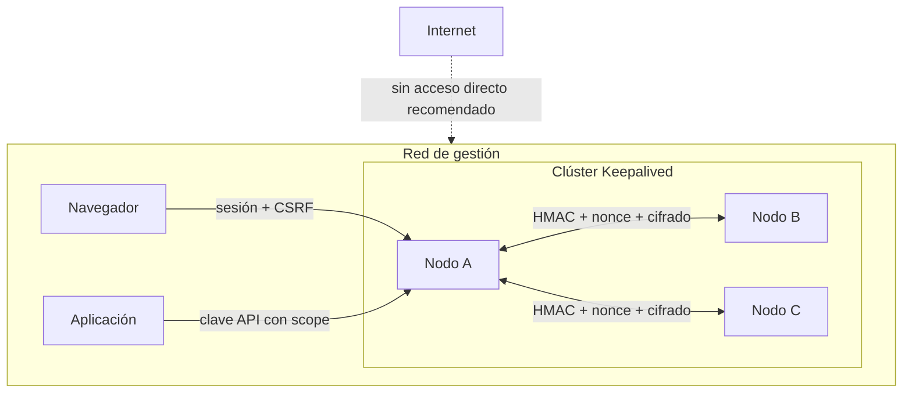

# Modelo de seguridad

## Activos

- capacidad de mover direcciones y afectar rutas de producción;
- inventario del pool y topología;
- cuentas, roles y sesiones;
- secretos TOTP y códigos de recuperación;
- claves API de aplicaciones;
- canal de réplica entre nodos.

## Fronteras de confianza

Los miembros del clúster forman un único dominio de confianza. El token HMAC compartido
protege frente a emisores externos y a repetición en la red, pero no aísla un miembro ya
comprometido: quien obtiene acceso root a un nodo y al token puede autenticar mensajes como
otro miembro lógico. Ante esa situación se debe considerar comprometido todo el plano de
control, aislarlo, restaurar estado coherente y rotar coordinadamente el token; no basta con
expulsar únicamente el contenedor afectado.

## Controles

| Riesgo | Control |
|---|---|
| robo de contraseña almacenada | `scrypt` con sal individual |
| secuestro de cookie desde JavaScript | `HttpOnly` |
| petición cruzada desde otra web | `SameSite=Strict`, origen y CSRF |
| repetición de mensaje interno | timestamp de 90 s y nonce de un solo uso |
| relojes fuera de sincronía | sincronización NTP/chrony en todos los hosts y rechazo previo del despliegue si el desfase excede el límite configurado |
| sobrescritura por reloj de pared o réplica obsoleta | revisiones vectoriales y selección del único dominante causal |
| dos escritores concurrentes | escritor lógico fijo: primer nodo de `FIP_NODOS` |
| pérdida de volúmenes confundida con alta nueva | bootstrap explícito, root-only y de un solo uso; ausencia sin marcador falla cerrada |
| secretos alcanzables por alias de bind mount | árboles de datos y secretos separados, sin igualdad ni anidamiento |
| tag mutable durante el despliegue | `pull` previo, `RepoDigest` inmutable, metadatos OCI de revisión/versión/protocolo, misma revisión en la cohorte, arranque por ID `sha256` y comprobación final del ID |
| estado corrupto o divergente descubierto demasiado tarde | copias privadas de todos los nodos y preflight causal dentro de la imagen candidata Linux, sin red, read-only y sin capacidades, antes de cambiar permisos o detener contenedores |
| URL duplicada simulando mayoría | cuórum contado por identidad lógica autenticada |
| envío de estado nuevo a un nodo antiguo | descubrimiento de capacidad y endpoints v2 sin fallback |
| lectura de TOTP en disco | Fernet derivado del secreto de sesión |
| filtración de clave API en `security.json` | HMAC; el token sólo se muestra al crear |
| clave de aplicación demasiado potente | scopes explícitos y una clave por aplicación |
| pérdida del último administrador | bloqueo de desactivación/degradación |
| apropiación del registro inicial | alta disponible sólo sin usuarios, cierre inmediato y panel restringido a la red de gestión |
| fuerza bruta web básica | limitación por origen y mensajes genéricos |
| carga de interfaz en un iframe | `X-Frame-Options: DENY` y CSP `frame-ancestors` |
| MIME o referencia externa inesperada | `nosniff`, CSP y `Referrer-Policy` |
| secreto expuesto en Compose | variables `_FILE`, ficheros root-only y árbol separado del bind mount `/datos` |
| sustitución o corrupción de estado local | esquema cerrado, límite de 512 KiB, rechazo de enlaces/FIFO/hardlinks y escritura atómica con `fsync` |
| filtración desde backups de datos | `keepalived.conf` se considera secreto porque contiene la clave VRRP; datos y secretos se respaldan como material sensible y separado |
| contenedor comprometido | rootfs de sólo lectura, `cap-drop=ALL`, tres capacidades VRRP y `SETGID` para el health check de Keepalived, `no-new-privileges` y límite de procesos |

Pool y credenciales se reconcilian antes de cada mutación y exigen confirmación de una
mayoría. La disponibilidad de escritura se sacrifica si falta el escritor o el cuórum; las VIP
ya aplicadas y su elección VRRP no dependen de que el plano de control pueda escribir.

Los ACK internos están cifrados y ligados a la identidad lógica, capacidad y huella exacta
del snapshot. El receptor de una réplica de pool no recarga Keepalived sólo por recibirla:
espera a demostrar el estado con su propia mayoría. Las revisiones concurrentes, obsoletas o
con el mismo reloj y distinto contenido se rechazan; una marca de tiempo nunca desempata.

## Despliegue transaccional

El despliegue real sólo admite la topología completa N/N. Antes de mutar crea un journal
root-only en cada nodo, instala la barrera `.deploy-freeze`, toma snapshots duraderos y preserva
el contenedor anterior. La barrera tiene contenido y metadatos exactos; mientras existe, las
mutaciones externas fallan cerradas, aunque la anti-entropía interna pueda terminar una
reconciliación ya autorizada.

La decisión de commit se publica de forma duradera antes de instalar la plantilla definitiva o
retirar el rollback. Si el fallo sucede antes de esa decisión, la recuperación detiene la
cohorte, restaura todos los snapshots y reinicia los contenedores anteriores. Si el commit ya
fue decidido, prevalece: una nueva invocación completa hacia delante la plantilla, los
contenedores y la limpieza, dejando al escritor lógico para el final. El descubrimiento también
recupera preparaciones, candidatos y limpiezas interrumpidas aunque falte un marcador auxiliar.

Los journals, snapshots, barreras, contenedores de rollback y temporales reconocidos forman
parte del protocolo. No se borran ni renombran manualmente para «desbloquear» una operación: se
vuelve a ejecutar el coordinador con el mismo manifiesto y secretos, o se conserva toda la
evidencia para recuperación asistida si el diagnóstico sigue fallando.

## Cabeceras HTTP

El servidor aplica a HTML y JSON:

- `Content-Security-Policy` limitada al mismo origen y recursos `data:` sólo para imágenes;
- `X-Content-Type-Options: nosniff`;
- `X-Frame-Options: DENY`;
- `Referrer-Policy: no-referrer`;
- `Permissions-Policy` desactiva cámara, micrófono y geolocalización;
- `Strict-Transport-Security` cuando `FIP_COOKIE_SECURE=1`;
- `Cache-Control: no-store` en respuestas JSON.

## Datos que nunca deben registrarse

- contraseñas actuales o temporales;
- cookies o CSRF;
- clave API completa;
- secreto TOTP, URI `otpauth` o QR;
- códigos de recuperación;
- `FIP_SESSION_SECRET`, `FIP_CLUSTER_TOKEN` o clave VRRP.

No existe contraseña de arranque. La contraseña del primer administrador nace en el navegador
y se almacena únicamente como derivación `scrypt`. Mientras no haya usuarios, cualquier persona
con acceso de red al panel podría registrar esa primera cuenta; por eso el servicio debe
permanecer limitado a la red de gestión durante la instalación. El registro sólo se admite en
el escritor lógico con cuórum disponible, pero esa condición no sustituye el control de acceso
a la red.

## Transporte

El producto puede ejecutarse por HTTP en una red local, pero las credenciales viajan entonces
sin TLS. Para redes no completamente confiables, publicar el panel detrás de HTTPS, mantener
el acceso restringido a la red de gestión y activar `FIP_COOKIE_SECURE=1`.

La firma interna autentica mensajes y el sobre Fernet protege las respuestas y el estado de
seguridad, pero no sustituye una segmentación de red adecuada.
