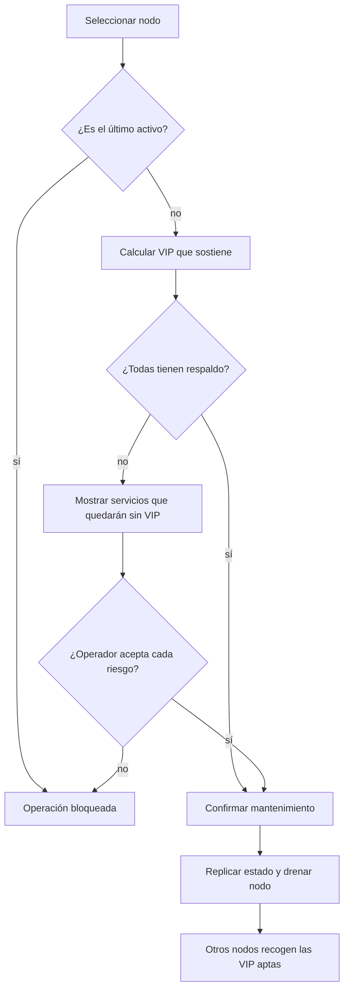

# Operación, mantenimiento y recuperación

## Lectura diaria

El panel distingue:

- **portador real**: nodo que tiene la VIP en su interfaz;
- **servidor por defecto**: preferencia humana guardada en el pool;
- **disponible**: nodo accesible, fuera de mantenimiento y con el servicio sano;
- **sin respaldo**: ningún otro nodo puede sostener esa dirección;
- **duplicada**: dos nodos anuncian simultáneamente la misma VIP; requiere intervención.

El panel se actualiza cada seis segundos y no conserva una copia local en el navegador.

El estado autenticado indica `pool_writer`, `pool_writable` y `pool_ready`. Todas las
mutaciones se realizan en el primer nodo de `FIP_NODOS`; los demás nodos siguen disponibles
para lecturas y failover de VIP, pero no reenvían una escritura de forma transparente.

## Mantenimiento de un nodo



Procedimiento recomendado:

1. Abrir el panel del escritor e iniciar sesión como operador o administrador.
2. Revisar servicios sin respaldo.
3. Activar mantenimiento y aceptar sólo los riesgos comprendidos.
4. Esperar a que cada VIP aparezca en otro portador.
5. Trabajar sobre el servidor.
6. Devolverlo a servicio y comprobar la estabilización.

## Copia de seguridad

Respaldar de forma coherente el directorio persistente de cada nodo, especialmente:

- `pool.json`;
- `security.json`;
- `keepalived.conf`;
- plantilla Unraid generada;
- secretos externos de sesión, clúster y VRRP.

`keepalived.conf` contiene material de autenticación VRRP. El árbol de datos y sus copias
deben tratarse como sensibles aunque los tres ficheros de secretos se almacenen aparte.

`security.json` sin `FIP_SESSION_SECRET` no permite recuperar TOTP ni validar claves API.
El secreto sin `security.json` tampoco recupera usuarios. Deben formar parte del mismo plan
de backup, pero almacenarse por separado.

Detener o congelar las mutaciones antes de copiar. Respaldar los tres nodos y conservar juntos
los ficheros que pertenecen a la misma revisión causal. En una restauración, no editar
`revision`, `clock`, `author` ni `legacy_base`, y no mezclar a mano snapshots divergentes.
Arrancar primero una mayoría que contenga el mismo estado; sólo entonces un nodo nuevo sin
fichero se rellena desde la réplica dominante y no se trata como un estado vacío competidor.
En un clúster de dos nodos, un único superviviente materializado no constituye cuórum y no
puede inicializar automáticamente el reemplazo: restaurar en éste una copia coherente antes
del arranque. Esta limitación es el coste deliberado de no aceptar como verdad una sola copia
posiblemente obsoleta.

La semilla declarada en el manifiesto no es un mecanismo de recuperación. Sólo se materializa
en el alta inicial autorizada mediante `--fresh-install`, cuando todo el clúster está vacío.
Una actualización o reemplazo con `pool.json` ausente debe adoptar la mayoría causal descrita
arriba; nunca volver a ejecutar `--fresh-install` ni recrear `.bootstrap-pool` o
`.bootstrap-security`.

## Recuperación del despliegue

El preflight remoto valida las copias de todos los nodos dentro de la imagen candidata Linux
antes de tocar permisos o parar contenedores. Superada esa puerta, el coordinador ejecuta una
única transacción sobre la topología completa: journal y snapshots duraderos, barrera
`.deploy-freeze`, contenedor anterior preservado, verificación de la cohorte y decisión de
commit. Debe programarse una ventana de mantenimiento con indisponibilidad planificada: no
existe una modalidad rolling ni se permite actualizar un subconjunto en un despliegue real.

Una nueva invocación intenta recuperar cualquier transacción reconocida antes de iniciar otra:

- antes de la decisión de commit, detiene la cohorte y restaura datos, plantilla y contenedores
  anteriores en todos los nodos;
- después de la decisión de commit, completa hacia delante la instalación y la limpieza; no
  convierte un commit durable en rollback;
- el escritor lógico se limpia el último, para conservar la mejor evidencia y capacidad de
  coordinación hasta que los demás miembros hayan terminado;
- una preparación, publicación de plantilla o limpieza interrumpida se reanuda a partir de sus
  marcadores duraderos y del estado real de Docker.

Conservar además backups externos coherentes y el digest exacto de la imagen anterior. No
borrar manualmente journals, snapshots, `.deploy-freeze`, temporales reconocidos ni
contenedores de rollback: se perdería la información con la que el coordinador distingue
commit de reversión. Si la recuperación automática aborta, prolongar la ventana, impedir
nuevas mutaciones externas y recopilar el estado de los tres nodos tal como quedó; no forzar
paradas, arranques o renames fuera del coordinador antes de clasificar el fallo.

## Rotación de secretos de infraestructura

La versión 1.0.7 no automatiza una rotación segura en sitio. El despliegue compara huellas
en todos los nodos y aborta sin cambios si el material local no coincide con el activo.

- El secreto de sesión está ligado a cookies, TOTP cifrados y hashes de claves API. Sustituirlo
  sin una migración de credenciales deja esas identidades inutilizables.
- El token de clúster debe cambiar simultáneamente con las mutaciones congeladas; mezclarlo
  divide el plano de réplica.
- La clave VRRP debe cambiar en todos los nodos y configuraciones dentro de una ventana
  coordinada; mezclarla divide el dominio VRRP.

Ante una sustitución accidental, detener la operación y restaurar los ficheros correctos desde
el backup coherente. No intentar que `deploy-floating-ip.sh` fuerce o propague la nueva clave.

## Pérdida de acceso

1. Probar un código de recuperación del usuario.
2. Pedir a otro administrador que restablezca la cuenta; esto invalida sesiones y 2FA.
3. Si no queda ningún administrador utilizable, restaurar `security.json` y los secretos de
   una copia coherente.

No editar manualmente hashes, revisiones o secretos TOTP. La protección de última cuenta
administradora evita el bloqueo accidental, pero no sustituye las copias externas.

## Clave API comprometida

1. Revocar inmediatamente la clave desde **Cuenta → Claves API**.
2. Crear otra con nombre que identifique la rotación.
3. Actualizar sólo la aplicación afectada.
4. Confirmar que la clave antigua obtiene `401 INVALID_API_KEY`.
5. Revisar reclamaciones activas y liberar únicamente las que pertenezcan a operaciones
   conocidas.

La revocación pone el hash a `null` y replica el estado. Una clave revocada no se reactiva;
se crea una nueva.

## Nodo aislado o réplica incompleta

- No forzar otro escritor ni alterar relojes o marcas de tiempo para resolver el incidente.
- No recrear `.bootstrap-pool` ni `.bootstrap-security` para recuperar una mayoría perdida.
  Restaurar juntos `pool.json` y `security.json` desde un backup coherente; los marcadores sólo
  pertenecen al alta nueva de directorios vacíos.
- Recuperar conectividad; la anti-entropía periódica vuelve a consultar snapshots. Reiniciar el
  contenedor sólo si el proceso no se recupera, después de drenar o confirmar que no porta VIP.
- Comprobar `/api/health` en todos los nodos y `/api/status` con una sesión de lectura para
  verificar `pool_ready`, escritor y versión.
- Iniciar sesión en un nodo reconciliado y verificar usuarios y claves.
- Confirmar que pool, revisión y portadores coinciden antes de mantenimiento.
- Si aparece un conflicto causal, congelar las mutaciones y restaurar una copia coherente; no
  elegir un ganador por `timestamp` ni copiar un fichero sobre los demás.

## Comprobaciones posteriores a un despliegue

```bash
curl --fail http://HOST_NODO_1:6060/api/health
curl --fail http://HOST_NODO_2:6060/api/health
curl --fail http://HOST_NODO_3:6060/api/health
```

Después:

- una ruta protegida sin credencial debe responder `401`;
- la salud pública debe contener sólo liveness y versión, sin nombres, pares, escritor ni
  estado de autenticación;
- una clave con `status:read` debe leer direcciones;
- esa misma clave debe obtener `403` al reclamar;
- una clave con `claims:write` debe poder repetir de forma idempotente una operación de
  prueba sólo contra el escritor y si existe una VIP apta;
- una mutación enviada a otro nodo debe cerrarse como escritor requerido, sin cambiar disco;
- retirar un par por debajo del cuórum debe bloquear nuevas mutaciones sin detener el failover
  de las VIP ya configuradas;
- no ejecutar mantenimiento como prueba automática;
- cada VIP debe tener exactamente un portador.

## Incidentes que no deben repetirse

- No usar imágenes que reescriban `keepalived.conf` al iniciar.
- No montar `check-http` desde un sistema FAT que pierde el bit de ejecución.
- No eliminar el contenedor a la fuerza antes de darle ocasión de soltar las VIP.
- No confiar en un `HEALTHCHECK` basado en `docker exec` en nodos donde el runtime pierde su
  directorio de estado.
- No considerar saludable una SPA cuya ruta devuelve HTML con `200` para cualquier URL.
- No comprobar si una VIP está libre desde el nodo que puede tenerla localmente.
- No cambiar el primer elemento ni el orden de `FIP_NODOS` nodo a nodo.
- No desplegar mutaciones causales sobre una mezcla de nodos v2 y antiguos: primero formar una
  mayoría v2 con las escrituras congeladas.
