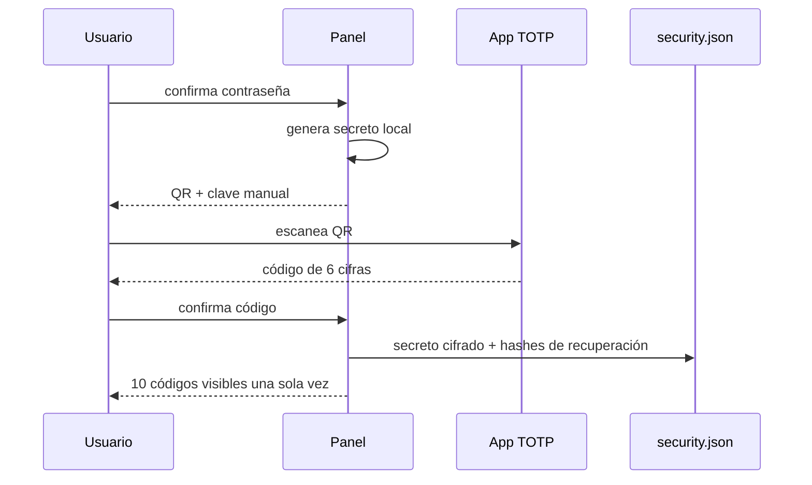

# Usuarios, roles y segundo factor

## Primer administrador

Cuando existe un snapshot causal de `security.json` sin usuarios, la pantalla muestra el flujo
de primer acceso. La mera ausencia del fichero no abre el registro: en una instalación nueva,
el marcador root-only de un solo uso autoriza al escritor a materializar el vacío, replicarlo
con cuórum y consumir el marcador antes de que se cree el primer administrador. Si después se
pierden todos los volúmenes, el clúster falla cerrado y exige restauración; nunca vuelve a
interpretarse como nuevo.
La persona elige usuario, nombre visible y contraseña definitiva, que debe repetir para evitar
errores. La cuenta se crea como `admin` y el registro inicial se cierra inmediatamente. No hay
credenciales predeterminadas ni contraseñas de arranque en el contenedor o en ficheros.

El primer registro se realiza en el primer nodo declarado en `FIP_NODOS`, con una mayoría de
identidades lógicas accesible. La respuesta sólo se considera confirmada después de replicar
la revisión causal. Los demás nodos rechazan el alta inicial en vez de crear administradores
concurrentes.

## Roles

| Rol | Ver estado | Cambiar pool o mantenimiento | Gestionar usuarios y API |
|---|---:|---:|---:|
| Consulta (`reader`) | sí | no | no |
| Operador (`operator`) | sí | sí | no |
| Administrador (`admin`) | sí | sí | sí |

No se puede desactivar ni degradar la última cuenta administradora activa. En lugar de borrar
usuarios, se desactivan para conservar la trazabilidad de quién creó o cambió recursos.

## Contraseñas y sesiones

- Contraseñas derivadas con `scrypt` y sal aleatoria individual.
- Longitud mínima configurable, nunca inferior a 12 caracteres.
- Rechazo de valores comunes o iguales al nombre de usuario.
- Cookies `HttpOnly` y `SameSite=Strict`.
- Firma HMAC y caducidad máxima de sesión.
- Token CSRF distinto en cada sesión para todas las operaciones del navegador.
- Un cambio de contraseña, rol, estado o 2FA incrementa la versión de sesión e invalida las
  sesiones anteriores.
- Ocho fallos de acceso desde una dirección en cinco minutos activan limitación temporal.

## Configurar TOTP

El QR se genera dentro del contenedor; el secreto no se envía a un servicio externo. TOTP
usa SHA-1, seis cifras y periodos de 30 segundos, interoperable con las aplicaciones comunes.

## Códigos de recuperación

- Se generan diez códigos aleatorios.
- Sólo se guardan hashes HMAC.
- Cada código se consume al utilizarlo.
- Regenerar códigos invalida todos los anteriores.
- Un administrador que restablece una contraseña también elimina el 2FA del usuario y obliga
  a configurarlo de nuevo.

## Operaciones administrativas sensibles

Crear o modificar usuarios, restablecer accesos y crear o revocar claves API requiere:

1. sesión con rol administrador;
2. token CSRF de esa sesión;
3. contraseña actual del propio administrador;
4. código TOTP si el administrador tiene 2FA activo.

La interfaz utiliza formularios y mensajes internos. No depende de `alert()`, `confirm()` ni
otros avisos nativos del navegador.

Todas estas operaciones se envían al escritor lógico. Antes de autorizar o escribir, el nodo
reconcilia el estado de acceso con cuórum para no aceptar una sesión, contraseña o administrador
que ya haya sido revocado en una revisión posterior. Si una escritura queda persistida pero no
puede confirmarse por mayoría, se devuelve un resultado incierto: consultar el estado antes de
repetir la acción.

El runtime también rechaza estas mutaciones mientras exista una barrera `.deploy-freeze`
válida. El coordinador N/N instala y retira esa barrera como parte de su journal duradero: ante
una interrupción anterior al commit restaura la cohorte completa y, después del commit,
termina la instalación hacia delante. No se debe retirar la barrera manualmente mientras haya
una transacción recuperable.

## Recomendaciones

- Mantener al menos dos administradores activos.
- Activar 2FA en todas las cuentas administrativas y operadoras.
- Guardar los códigos de recuperación fuera del clúster.
- Crear cuentas individuales; no compartir usuarios.
- Desactivar inmediatamente las cuentas que ya no deban acceder.
